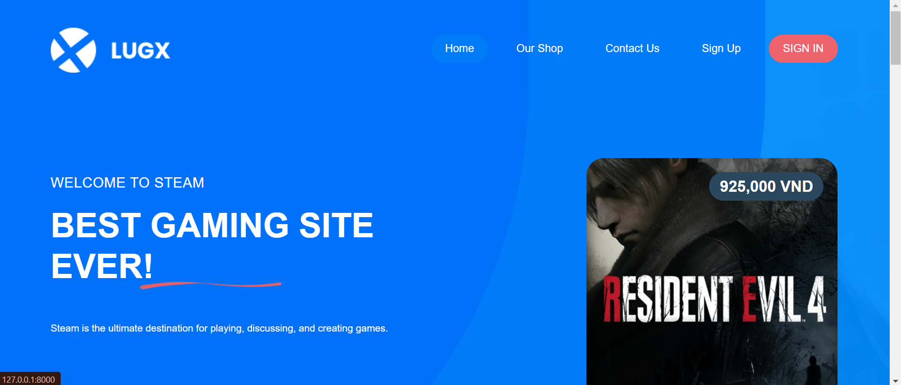

# Lugx - Game Selling Website

A game selling website like [Steam](https://store.steampowered.com/) built with **Laravel** and **Lugx template**. This is the best place where we can buy or sell games.
Some important functions I got here: 

- User functions (login, logout, change name, ...)
- **Sell** and **Buy** games
- Comment, search games with filter
- Co-op with many other companies
- Sale games if you are the owner
- **Give** or **Receive** games


## Authors

- [@OCEAN](https://github.com/ThanhTruong286)


## Tech Stack

**Client:** [Lugx Template](https://templatemo.com/tm-589-lugx-gaming), Bootstrap 5  
**Server:** PHP, Laravel, WAMP Server


## Installation

**Require**
- PHP version >= 8.0
- Laravel framework 9
- Composer

Install project with Composer and artisan

*Clone project*
```bash
  git clone https://github.com/ThanhTruong286/game-selling-website.git
```
*Move into project*
```bash
  cd game-selling-website
```
*Composer update*
```bash
  composer update
```
*Create database*
```bash
  php artisan migrate
  php artisan db:seed
```
*Run project*
```bash
  php artisan serve
```
    
## Screenshots



